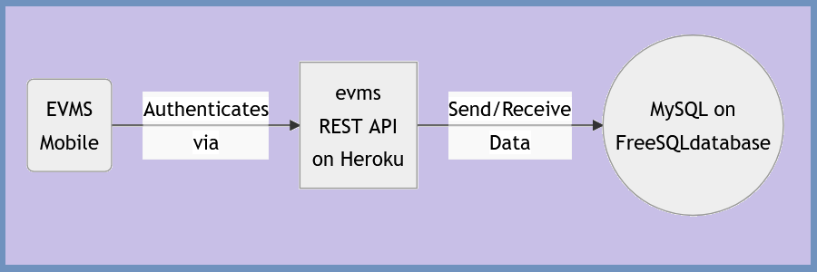
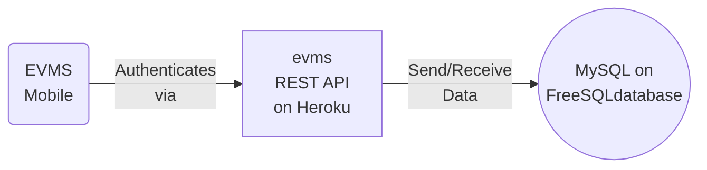

# How to Build Employee Vaccination Management Mobile System on Android
Employee Vaccination Management System Mobile android application interacts with the REST API based on SpringBoot/Hibernate on Heruku with a MySQL Database on FreeSQLDatabase

## Workflow

## References
<ul>
  <li><a href="https://developer.android.com/studio/?gclid=CjwKCAiA4veMBhAMEiwAU4XRr33tX8yX3SfpTJCwU3Gtul2zrAVsgGS1nf9-CiB4ApRNUerZvMGZ2RoCACkQAvD_BwE&gclsrc=aw.ds">Android Studio</a></li>
  <li><a href="https://www.youtube.com/watch?v=SY50wbkuoS8&list=PL5pIDFWFLqx1_4s3uPdcD-ONBDAOWVmlP">COVID19 Employee Vaccine Management System Java SQL Tutorial Series (10 Videos)</a></li>
  <li><a href="https://www.youtube.com/watch?v=NVHa3BbDAX0">Java SQL Tutorial: Secure SpringBoot Rest API (Part 2/Final)</a></li>
  <li><a href="https://www.youtube.com/watch?v=qBgp3q0Kli0">Deploy SpringBoot Java MySQL Secured Web App on Heroku & freesqldatabase Tutorial</a></li>
</ul>

## Tutorial
